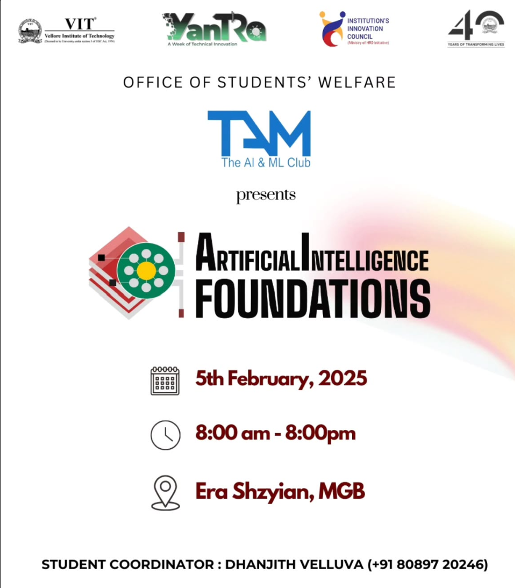

> This repository is still missing some files and information which I will fill up ASAP!

# 

## AI Foundations : A deep learning workshop

**The AI & ML Club, VIT Vellore**  
_5th February 2025_

---

### Overview

A hands-on session on AI and Machine Learning.  
Please refer to the attached PDFs for more detailed information.

---

### Notebooks:

---

> Use the given python version for best experience
> `pip install opencv-contrib-python==4.10.0.84`

### Social Media:

- **Yantra:** 
- **AI & ML Club:** 

### Speakers:

---
