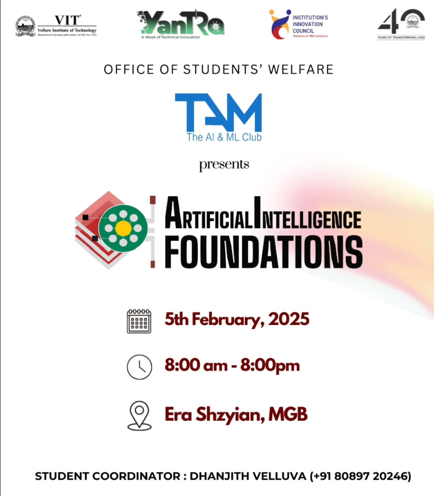

# 

## AI Foundations : A deep learning workshop

**The AI & ML Club, VIT Vellore**  
_5th February 2025_

---

### Overview

A hands-on session on AI and Machine Learning.  
Please refer to the attached resources for more detailed information.

#### AI Foundations  
**Presenter:** Somil Agrawal  
[View Presentation](https://docs.google.com/presentation/d/1k38wbusxDBtZHqfEXxSHiciG1rbSFiaJ/edit?usp=sharing&ouid=104278266749611379397&rtpof=true&sd=true)

#### AI in Audio Processing  
**Presenter:** Samiksha VB  
[View Presentation](https://prezi.com/view/CvKHWxZPxlLCMsL7N7mR/)

#### AI & ML in Audio: From Noise to Notes  
**Presenter:** Reyansh Ashok  
[View Presentation](https://prezi.com/view/cWp2JmCy3K3xR6jN72Xt/)

#### Concept Map  
**Creator:** Mayank Gupta  
[View Mind Map](https://xmind.ai/share/tLFuVHnQ)

---

### Notebooks:

---

> Use the given python version for best experience
> `pip install opencv-contrib-python==4.10.0.84`

### Social Media:

- **Yantra:** 
- **AI & ML Club:** 

---
